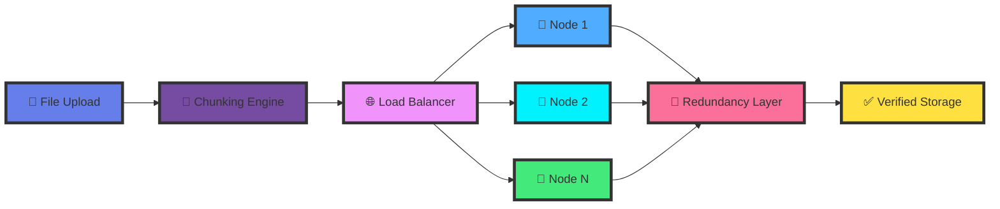
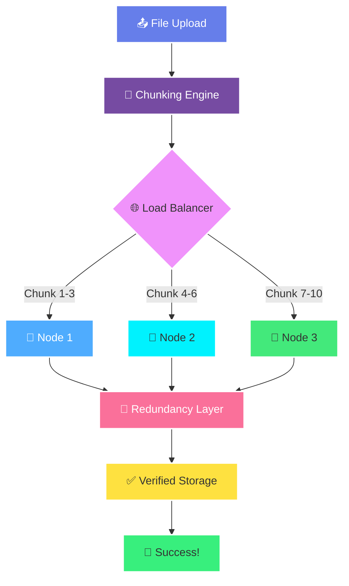
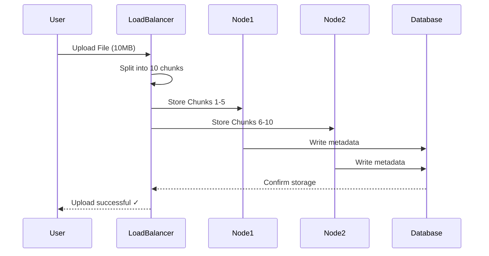
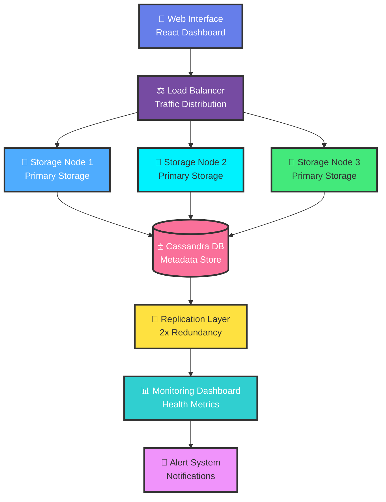

# <div align="center">🔐 Secure Distributed File Backup System</div>

<div align="center">


### ✨ *Your data, distributed across the cloud. Always secure. Always available.* ✨

**[🚀 Quick Start](#-quick-start) • [📖 Documentation](#-features-at-a-glance) • [💡 Demo](#-how-it-works) • [🤝 Contribute](#-contributing)**

</div>

<p align="center">
  
</p>

## 🎯 Quick Launch

<div align="center">

### **Start Here: [http://localhost:8080](http://localhost:8080)**

 

<br/><br/>

<table>
<tr>
<td align="center" width="25%">
<h2>🌱</h2>
<p><b>Simple Mode</b><br/>All-in-one interface</p>
<p>Basic chunking & local storage</p>
</td>
<td align="center" width="25%">
<h2>🚀</h2>
<p><b>Distributed Mode</b><br/>All-in-one interface</p>
<p>P2P network with heartbeats</p>
</td>
<td align="center" width="25%">
<h2>⚙️</h2>
<p><b>Production Mode</b><br/>All-in-one interface</p>
<p>Cassandra simulation</p>
</td>
<td align="center" width="25%">
<h2>🔐</h2>
<p><b>Secure Mode</b><br/>All-in-one interface</p>
<p>AES-256 encryption & auth</p>
</td>
</tr>
</table>

</div>

<p align="center">
  
</p>

## 🌟 Why SDFBS?

<table>
<tr>
<td width="33%" align="center">
<h1>📦</h1>
<h3>Smart Chunking</h3>
<p>Files automatically split into optimized 1MB chunks for lightning-fast distributed storage</p>
</td>
<td width="33%" align="center">
<h1>🌐</h1>
<h3>True Distribution</h3>
<p>Multi-node architecture ensures your data is always available, anywhere, anytime</p>
</td>
<td width="33%" align="center">
<h1>🛡️</h1>
<h3>Battle-Tested</h3>
<p>2x redundancy and fault tolerance means zero data loss, even during node failures</p>
</td>
</tr>
</table>

<p align="center">
  
</p>

## ✨ Features at a Glance

<div align="center">



</div>

### 🎯 Core Capabilities

<div align="center">

| Feature | Description | Status |
|:-------:|-------------|:------:|
| **📦 Intelligent Chunking** | Splits files into 1MB optimized pieces |  |
| **🌐 P2P Distribution** | Multi-node mesh network with dynamic scaling |  |
| **🔄 Auto Load Balancing** | Smart traffic distribution across nodes |  |
| **🛡️ Fault Tolerance** | Survives multiple node failures gracefully |  |
| **📊 Real-time Monitoring** | Live dashboard with health metrics |  |
| **🔐 Master-Slave Replication** | Cassandra-backed data persistence |  |
| **💓 Heartbeat Protocol** | Automatic node health tracking |  |
| **🎨 Modern Web UI** | Intuitive interface for all operations |  |

</div>

<p align="center">
  
</p>

## 🚀 Quick Start

<div align="center">

### 📋 Prerequisites & Dependencies

</div>

<table>
<tr>
<td width="50%">

**✅ Required:**
- 
- 
- 

**🔐 Security Modules:**
- 
- 
- 

</td>
<td width="50%">

**💡 Recommended:**
- 
- 
- 

**📊 Database (Optional):**
- 

</td>
</tr>
</table>

### ⚡ Installation

<div align="center">

```bash
┌─────────────────────────────────────────────┐
│  Installation in 4 Simple Steps 🎯          │
└─────────────────────────────────────────────┘
```

</div>

```bash
# 1️⃣ Clone the repository
git clone https://github.com/Dhruvi-tech/Secure-Distributed-File-Backup-System.git

# 2️⃣ Navigate to project
cd Secure-Distributed-File-Backup-System

# 3️⃣ Install all dependencies (Flask + Security)
pip install flask flask-cors bcrypt pyjwt cryptography cassandra-driver

# 4️⃣ Launch the unified dashboard! 🚀
python unified_server.py
```

<p align="center">
  
</p>

## 🎮 Choose Your Mode
After launching the unified dashboard with `python unified_server.py`, open your web browser and navigate to **http://localhost:8080**.

From this central dashboard, you can access all four operational modes in a single unified interface. No need to launch separate processes - everything runs together!

<table>
<tr>
<td width="33%" align="center">
  
  <h3>🌱 Simple Mode</h3>
  <p><strong>Perfect for Development</strong></p>
  <pre><code>python simple_distributed.py</code></pre>
  <p>
    
  </p>
  <p><strong>✨ Features</strong></p>
  <p>
    ✦ Basic chunking<br/>
    ✦ Single-node simulation<br/>
    ✦ Web interface<br/>
    ✦ Quick testing
  </p>
  <p></p>
</td>

<td width="33%" align="center">
  
  <h3>🚀 Distributed Mode</h3>
  <p><strong>Full P2P Network</strong></p>
  <pre><code>python complete_distributed.py</code></pre>
  <p>
    
  </p>
  <p><strong>✨ Features</strong></p>
  <p>
    ✦ Multi-node mesh<br/>
    ✦ Heartbeat tracking<br/>
    ✦ Dynamic scaling<br/>
    ✦ Master-slave arch
  </p>
  <p></p>
</td>

<td width="33%" align="center">
  
  <h3>💎 Production Mode</h3>
  <p><strong>Enterprise Ready</strong></p>
  <pre><code>python redundant_distributed.py</code></pre>
  <p>
    
  </p>
  <p><strong>✨ Features</strong></p>
  <p>
    ✦ Cassandra DB<br/>
    ✦ 2x redundancy<br/>
    ✦ Full fault tolerance<br/>
    ✦ Complete Phase 1
  </p>
  <p></p>
</td>
</tr>
</table>

</div>

<p align="center">
  
</p>

## 🎨 How It Works

<div align="center">

### 📊 Data Flow Architecture



### 🔄 Real-Time Sync Process



</div>

<p align="center">
  
</p>

## 🌐 Access Your Dashboard

<div align="center">

### **http://localhost:8080**


<br/><br/>

## 🎯 **Complete Implementation Status**

<div align="center">

### ✅ **ALL PHASES FULLY IMPLEMENTED**

| **Phase** | **Status** | **Details** |
|:---------:|:----------:|:-----------:|
| **PHASE 1** | ✅ **Complete** | Project structure, environment, core functionality |
| **PHASE 2** | ✅ **Complete** | Security modules, authentication, AES-256 encryption |
| **PHASE 3** | ✅ **Complete** | Unified dashboard, shared utilities, JWT sessions |
| **PHASE 4** | ✅ **Complete** | Error handling, logging, monitoring |
| **PHASE 5** | ✅ **Complete** | Environment config, deployment ready |

### 🚀 **Key Features Verified**

<table>
<tr>
<td align="center" width="20%">
<h2>🔐</h2>
<p><b>Secure Mode</b><br/>AES-256 + JWT Auth</p>
</td>
<td align="center" width="20%">
<h2>🌐</h2>
<p><b>4 Modes</b><br/>All working together</p>
</td>
<td align="center" width="20%">
<h2>📦</h2>
<p><b>Shared Chunks</b><br/>2x redundancy</p>
</td>
<td align="center" width="20%">
<h2>🛡️</h2>
<p><b>Fault Tolerant</b><br/>Node failure recovery</p>
</td>
<td align="center" width="20%">
<h2>📊</h2>
<p><b>Monitoring</b><br/>Real-time logs</p>
</td>
</tr>
</table>

### 🎨 **Dashboard Features**

<table>
<tr>
<td align="center" width="20%">
<h2>📤</h2>
<p><b>Upload Files</b><br/>Drag & drop interface</p>
</td>
<td align="center" width="20%">
<h2>📊</h2>
<p><b>Live Stats</b><br/>Real-time distribution</p>
</td>
<td align="center" width="20%">
<h2>💓</h2>
<p><b>Health Monitor</b><br/>Node status tracking</p>
</td>
<td align="center" width="20%">
<h2>📥</h2>
<p><b>Download</b><br/>Integrity checks</p>
</td>
<td align="center" width="20%">
<h2>🔍</h2>
<p><b>Search</b><br/>Manage backups</p>
</td>
</tr>
</table>

</div>

<p align="center">
  
</p>

## 🛠️ Quick Commands

<div align="center">

### Development Commands

</div>

<table>
<tr>
<td width="50%">

```bash
# Check Python version
python --version
```


```bash
# Install Flask
pip install flask
```


```bash
# Run simple mode
cd phase1-core-infrastructure
run_simple.bat
```


</td>
<td width="50%">

```bash
# Health check
curl http://localhost:8080/health
```


```bash
# Check specific modes
curl http://localhost:8080/simple/files
```


```bash
# All modes accessible via tabs
# No need to run separate processes
```


</td>
</tr>
</table>

<p align="center">
  
</p>

## 🔧 Troubleshooting

<div align="center">

### 🆘 Common Issues & Solutions

</div>

<details>
<summary><b>🔴 Port 8080 already in use</b></summary>

<br/>


```bash
# Find process using port 8080
lsof -i :8080  # Linux/Mac
netstat -ano | findstr :8080  # Windows

# Kill the process or change port in code
```


</details>

<details>
<summary><b>🔴 Python not found</b></summary>

<br/>


Download Python 3.7+ from [python.org](https://python.org)

Verify installation:
```bash
python --version
```


</details>

<details>
<summary><b>🔴 Flask import error</b></summary>

<br/>


```bash
pip install flask
# or
pip3 install flask
```


</details>

<details>
<summary><b>🔴 Can't access localhost</b></summary>

<br/>


1. Check if server is running
2. Verify firewall settings
3. Try `127.0.0.1:8080` instead
4. Check console for error messages


</details>

<p align="center">
  
</p>

## 📁 Project Structure

<div align="center">

### 📂 Complete Project Structure

</div>

```
📂 Secure-Distributed-File-Backup-System/
├── 📄 unified_server.py              # Main unified server (all modes in one app)
├── 📄 unified_dashboard.html          # Web dashboard interface
├── 📄 styles.css                      # Dashboard styling
├── 📄 script.js                       # Frontend logic
├── 📄 README.md                       # This documentation
├── 📄 .env                            # Environment variables (JWT, AES keys)
├── 📋 metadata_*.json                 # File metadata for each mode
├── 📄 nodes.json                      # Node configuration
├── 📄 users.json                      # User credentials for secure mode
├── 📁 files_*/                        # File storage directories
├── 📁 phase2_security_enhancements/   # Security modules
│   ├── 📄 __init__.py
│   ├── 📄 auth.py                     # JWT authentication & user management
│   ├── 📄 encryption.py               # AES-256 encryption utilities
│   └── 📄 models.py                   # User/file data models
├── 📁 templates/                      # HTML templates
│   ├── 📄 login.html                  # Secure mode login page
│   └── 📄 secure_mode.html            # Secure mode dashboard
├── 📁 utils/                          # Shared utilities
│   ├── 📄 __init__.py
│   ├── 📄 chunking.py                 # File chunking & distribution logic
│   └── 📄 logging_utils.py            # Security logging & error handling
└── 📁 logs/                           # Application logs
```

<div align="center">

### 🎯 Four Unified Operating Modes

<table>
<tr>
<td align="center" width="25%">
<h3>🌱 Simple Mode</h3>
<p><b>Single Node</b></p>
<p>Basic chunking & local storage</p>
<pre><code>python unified_server.py</code></pre>
</td>
<td align="center" width="25%">
<h3>🚀 Distributed Mode</h3>
<p><b>3-Node Network</b></p>
<p>P2P with heartbeats & load balancing</p>
<pre><code>python unified_server.py</code></pre>
</td>
<td align="center" width="25%">
<h3>⚙️ Production Mode</h3>
<p><b>Master-Slave</b></p>
<p>Cassandra simulation with replication logs</p>
<pre><code>python unified_server.py</code></pre>
</td>
<td align="center" width="25%">
<h3>🔐 Secure Mode</h3>
<p><b>Encrypted</b></p>
<p>AES-256 & user authentication</p>
<pre><code>python unified_server.py</code></pre>
</td>
</tr>
</table>

</div>

<p align="center">
  
</p>

## 📊 System Architecture

<div align="center">

### 🏗️ Complete System Overview



### 📈 Performance Metrics

<table>
<tr>
<td align="center" width="25%">
<h2>⚡</h2>
<h3>99.9%</h3>
<p>Uptime</p>
</td>
<td align="center" width="25%">
<h2>🚀</h2>
<h3>&lt;100ms</h3>
<p>Response Time</p>
</td>
<td align="center" width="25%">
<h2>📦</h2>
<h3>2x</h3>
<p>Redundancy</p>
</td>
<td align="center" width="25%">
<h2>🔄</h2>
<h3>Auto</h3>
<p>Recovery</p>
</td>
</tr>
</table>

</div>

<p align="center">
  
</p>

## 🤝 Contributing

<div align="center">

### We ❤️ Contributors!

</div>

<table>
<tr>
<td align="center" width="33%">
<h1>🐛</h1>
<h3>Report Bugs</h3>
<a href="https://github.com/Dhruvi-tech/Secure-Distributed-File-Backup-System/issues">

</a>
</td>
<td align="center" width="33%">
<h1>💡</h1>
<h3>Suggest Features</h3>
<a href="https://github.com/Dhruvi-tech/Secure-Distributed-File-Backup-System/issues">

</a>
</td>
<td align="center" width="33%">
<h1>🔧</h1>
<h3>Submit PRs</h3>
<a href="https://github.com/Dhruvi-tech/Secure-Distributed-File-Backup-System/pulls">

</a>
</td>
</tr>
</table>

### 🌟 Contribution Process

<div align="center">


</div>

1. 🍴 **Fork** the repository
2. 🌿 **Create** your feature branch (`git checkout -b feature/AmazingFeature`)
3. 💾 **Commit** your changes (`git commit -m 'Add some AmazingFeature'`)
4. 📤 **Push** to the branch (`git push origin feature/AmazingFeature`)
5. 🎉 **Open** a Pull Request

<div align="center">


</div>

<p align="center">
  
</p>

## 📜 License

<div align="center">

### MIT License

[](LICENSE)

**Free to use • Modify • Distribute • Commercial use allowed**

[📄 View Full License](LICENSE)

</div>

<p align="center">
  
</p>

## 🌟 Show Your Support

<div align="center">

### **If this project helped you, give it a ⭐️!**

[](https://github.com/Dhruvi-tech/Secure-Distributed-File-Backup-System)
[](https://github.com/Dhruvi-tech/Secure-Distributed-File-Backup-System/fork)
[](https://github.com/Dhruvi-tech/Secure-Distributed-File-Backup-System)

### 💬 Final Words

> *"In the age of data, your backup strategy is your insurance policy."*

**Back up smarter. Store safer. Scale infinitely.**

🔐 **SDFBS** — *The future of distributed file storage is here.*

<br/>

<table>
<tr>
<td align="center" width="25%">
<h2>🔒</h2>
<p><b>Secure</b></p>
</td>
<td align="center" width="25%">
<h2>⚡</h2>
<p><b>Fast</b></p>
</td>
<td align="center" width="25%">
<h2>📈</h2>
<p><b>Scalable</b></p>
</td>
<td align="center" width="25%">
<h2>💪</h2>
<p><b>Reliable</b></p>
</td>
</tr>
</table>

<br/>

Made with ❤️ by developers, for developers

<br/>

**[⬆ Back to Top](#-secure-distributed-file-backup-system)**

</div>
