# <div align="center">🔐 Secure Distributed File Backup System</div>

<div align="center">


### *Enterprise-grade distributed storage with military-level redundancy*

**[🚀 Quick Start](#-quick-start) • [📖 Documentation](#-features-at-a-glance) • [💡 Demo](#-how-it-works) • [🤝 Contribute](#-contributing)**

---

<p align="center">
  
</p>

</div>

## 🌟 Why SDFBS?

<table>
<tr>
<td width="33%" align="center">
<h1>📦</h1>
<h3>Smart Chunking</h3>
<p>Files automatically split into optimized 1MB chunks for lightning-fast distributed storage</p>
</td>
<td width="33%" align="center">
<h1>🌐</h1>
<h3>True Distribution</h3>
<p>Multi-node architecture ensures your data is always available, anywhere, anytime</p>
</td>
<td width="33%" align="center">
<h1>🛡️</h1>
<h3>Battle-Tested</h3>
<p>2x redundancy and fault tolerance means zero data loss, even during node failures</p>
</td>
</tr>
</table>


## ✨ Features at a Glance

```mermaid
graph LR
    A[📁 File Upload] --> B[🔪 Chunking Engine]
    B --> C[🌐 Load Balancer]
    C --> D[💾 Node 1]
    C --> E[💾 Node 2]
    C --> F[💾 Node N]
    D --> G[🔄 Redundancy Layer]
    E --> G
    F --> G
    G --> H[✅ Verified Storage]
    
    style A fill:#667eea,stroke:#333,stroke-width:4px
    style B fill:#764ba2,stroke:#333,stroke-width:4px
    style C fill:#f093fb,stroke:#333,stroke-width:4px
    style D fill:#4facfe,stroke:#333,stroke-width:4px
    style E fill:#00f2fe,stroke:#333,stroke-width:4px
    style F fill:#43e97b,stroke:#333,stroke-width:4px
    style G fill:#fa709a,stroke:#333,stroke-width:4px
    style H fill:#fee140,stroke:#333,stroke-width:4px
```

<div align="center">



</div>

### 🎯 Core Capabilities

<div align="center">

| Feature | Description | Status |
|:-------:|-------------|:------:|
| **📦 Intelligent Chunking** | Splits files into 1MB optimized pieces |  |
| **🌠P2P Distribution** | Multi-node mesh network with dynamic scaling |  |
| **🔄 Auto Load Balancing** | Smart traffic distribution across nodes |  |
| **🛡️ Fault Tolerance** | Survives multiple node failures gracefully |  |
| **📊 Real-time Monitoring** | Live dashboard with health metrics |  |
| **🔠Master-Slave Replication** | Cassandra-backed data persistence |  |
| **💓 Heartbeat Protocol** | Automatic node health tracking |  |
| **🨠Modern Web UI** | Intuitive interface for all operations |  |

</div>


## 🚀 Quick Start

<div align="center">

### 📋 Prerequisites

</div>

<table>
<tr>
<td width="50%">

**✅ Required:**
- 
- 
- 

</td>
<td width="50%">

**💡 Recommended:**
- 
- 
- 

</td>
</tr>
</table>

### ⚡ Installation

<div align="center">

```bash
┌─────────────────────────────────────────────┐
│  Installation in 4 Simple Steps 🎯          │
└─────────────────────────────────────────────┘
```

</div>

```bash
# 1️⃣ Clone the repository
git clone https://github.com/Dhruvi-tech/Secure-Distributed-File-Backup-System.git

# 2️⃣ Navigate to project
cd Secure-Distributed-File-Backup-System/phase1-core-infrastructure

# 3️⃣ Install dependencies
pip install flask

# 4️⃣ Choose your mode and launch! 🚀
```


## 🎮 Choose Your Mode

<table>
<tr>
<td width="33%" align="center">

### 🌱 Simple Mode
<h1>🌱</h1>

**Perfect for Development**

```bash
python simple_distributed.py
```


**Includes:**
- ✅ Basic chunking
- ✅ Single-node simulation
- ✅ Web interface
- ✅ Quick testing

</td>
<td width="33%" align="center">

### 🚀 Distributed Mode
<h1>🚀</h1>

**Full P2P Network**

```bash
python complete_distributed.py
```


**Includes:**
- ✅ Multi-node mesh
- ✅ Heartbeat tracking
- ✅ Dynamic scaling
- ✅ Master-slave arch

</td>
<td width="33%" align="center">

### 💎 Production Mode
<h1>💎</h1>

**Enterprise Ready**

```bash
python redundant_distributed.py
```


**Includes:**
- ✅ Cassandra DB
- ✅ 2x redundancy
- ✅ Full fault tolerance
- ✅ Complete Phase 1

</td>
</tr>
</table>


## 🎨 How It Works

<div align="center">

### 📊 Data Flow Architecture

```
┌─────────────────────────────────────────────────────────────┐
│                    📤 File Upload (10MB)                     │
└────────────────────────────┬────────────────────────────────┘
                             │
                    ┌────────▼────────┐
                    │  🔪 CHUNKING    │
                    │   ENGINE        │
                    └────────┬────────┘
                             │
             ┌───────────────┼───────────────┐
             │               │               │
             ▼               ▼               ▼
    ┌────────────────┐ ┌────────────────┐ ┌────────────────┐
    │   💾 NODE 1    │ │   💾 NODE 2    │ │   💾 NODE 3    │
    │                │ │                │ │                │
    │  Chunk 1-3     │ │  Chunk 4-6     │ │  Chunk 7-10    │
    │  [▓▓▓▓▓▓▓▓]    │ │  [▓▓▓▓▓▓▓▓]    │ │  [▓▓▓▓▓▓▓▓]    │
    └────────┬───────┘ └────────┬───────┘ └────────┬───────┘
             │                  │                  │
             └──────────────────┼──────────────────┘
                                ▼
                    ┌───────────────────┐
                    │  🔄 REDUNDANCY    │
                    │    LAYER          │
                    │   (2x Copies)     │
                    └───────────────────┘
                                │
                                ▼
                    ┌───────────────────┐
                    │  ✅ VERIFIED      │
                    │     STORAGE       │
                    └───────────────────┘
```

### 🔄 Real-Time Sync Process

```mermaid
sequenceDiagram
    participant User
    participant LoadBalancer
    participant Node1
    participant Node2
    participant Database
    
    User->>LoadBalancer: Upload File (10MB)
    LoadBalancer->>LoadBalancer: Split into 10 chunks
    LoadBalancer->>Node1: Store Chunks 1-5
    LoadBalancer->>Node2: Store Chunks 6-10
    Node1->>Database: Write metadata
    Node2->>Database: Write metadata
    Database-->>LoadBalancer: Confirm storage
    LoadBalancer-->>User: Upload successful ✓
```



</div>


## 🌐 Access Your Dashboard

<div align="center">

### **http://localhost:8080**


<br/><br/>

<table>
<tr>
<td align="center" width="20%">
<h2>📤</h2>
<p><b>Upload Files</b><br/>Drag & drop interface</p>
</td>
<td align="center" width="20%">
<h2>📊</h2>
<p><b>Live Stats</b><br/>Real-time distribution</p>
</td>
<td align="center" width="20%">
<h2>💓</h2>
<p><b>Health Monitor</b><br/>Node status tracking</p>
</td>
<td align="center" width="20%">
<h2>📥</h2>
<p><b>Download</b><br/>Integrity checks</p>
</td>
<td align="center" width="20%">
<h2>🔍</h2>
<p><b>Search</b><br/>Manage backups</p>
</td>
</tr>
</table>

</div>


## 🛠️ Quick Commands

<div align="center">

### Development Commands

</div>

<table>
<tr>
<td width="50%">

```bash
# Check Python version
python --version
```


```bash
# Install Flask
pip install flask
```


```bash
# Run simple mode
python simple_distributed.py
```


</td>
<td width="50%">

```bash
# Health check
curl http://localhost:8080/health
```


```bash
# Run with redundancy
python redundant_distributed.py
```


```bash
# Check system status
curl http://localhost:8080/status
```


</td>
</tr>
</table>


## 🔧 Troubleshooting

<div align="center">

### 🆘 Common Issues & Solutions

</div>

<details>
<summary><b>🔴 Port 8080 already in use</b></summary>

<br/>


```bash
# Find process using port 8080
lsof -i :8080  # Linux/Mac
netstat -ano | findstr :8080  # Windows

# Kill the process or change port in code
```


</details>

<details>
<summary><b>🔴 Python not found</b></summary>

<br/>


Download Python 3.7+ from [python.org](https://python.org)

Verify installation:
```bash
python --version
```


</details>

<details>
<summary><b>🔴 Flask import error</b></summary>

<br/>


```bash
pip install flask
# or
pip3 install flask
```


</details>

<details>
<summary><b>🔴 Can't access localhost</b></summary>

<br/>


1. Check if server is running
2. Verify firewall settings
3. Try `127.0.0.1:8080` instead
4. Check console for error messages


</details>


## 📊 System Architecture

<div align="center">

### 🏗️ Complete System Overview

```mermaid
graph TB
    UI[🎨 Web Interface<br/>React Dashboard] --> LB[⚖️ Load Balancer<br/>Traffic Distribution]
    LB --> N1[💾 Storage Node 1<br/>Primary Storage]
    LB --> N2[💾 Storage Node 2<br/>Primary Storage]
    LB --> N3[💾 Storage Node 3<br/>Primary Storage]
    N1 --> DB[(🗄️ Cassandra DB<br/>Metadata Store)]
    N2 --> DB
    N3 --> DB
    DB --> R[🔄 Replication Layer<br/>2x Redundancy]
    R --> M[📊 Monitoring Dashboard<br/>Health Metrics]
    M --> A[🚨 Alert System<br/>Notifications]
    
    style UI fill:#667eea,color:#fff,stroke:#333,stroke-width:3px
    style LB fill:#764ba2,color:#fff,stroke:#333,stroke-width:3px
    style N1 fill:#4facfe,color:#fff,stroke:#333,stroke-width:3px
    style N2 fill:#00f2fe,color:#333,stroke:#333,stroke-width:3px
    style N3 fill:#43e97b,color:#333,stroke:#333,stroke-width:3px
    style DB fill:#fa709a,color:#fff,stroke:#333,stroke-width:3px
    style R fill:#fee140,color:#333,stroke:#333,stroke-width:3px
    style M fill:#30cfd0,color:#fff,stroke:#333,stroke-width:3px
    style A fill:#f093fb,color:#333,stroke:#333,stroke-width:3px
```



### 📈 Performance Metrics

<table>
<tr>
<td align="center" width="25%">
<h2>⚡</h2>
<h3>99.9%</h3>
<p>Uptime</p>
</td>
<td align="center" width="25%">
<h2>🚀</h2>
<h3>&lt;100ms</h3>
<p>Response Time</p>
</td>
<td align="center" width="25%">
<h2>📦</h2>
<h3>2x</h3>
<p>Redundancy</p>
</td>
<td align="center" width="25%">
<h2>🔄</h2>
<h3>Auto</h3>
<p>Recovery</p>
</td>
</tr>
</table>

</div>


## 🤝 Contributing

<div align="center">

### We ❤️ Contributors!

</div>

<table>
<tr>
<td align="center" width="33%">
<h1>🐛</h1>
<h3>Report Bugs</h3>
<a href="https://github.com/Dhruvi-tech/Secure-Distributed-File-Backup-System/issues">

</a>
</td>
<td align="center" width="33%">
<h1>💡</h1>
<h3>Suggest Features</h3>
<a href="https://github.com/Dhruvi-tech/Secure-Distributed-File-Backup-System/issues">

</a>
</td>
<td align="center" width="33%">
<h1>🔧</h1>
<h3>Submit PRs</h3>
<a href="https://github.com/Dhruvi-tech/Secure-Distributed-File-Backup-System/pulls">

</a>
</td>
</tr>
</table>

### 🌟 Contribution Process

```mermaid
graph LR
    A[🍴 Fork] --> B[🌿 Branch]
    B --> C[💻 Code]
    C --> D[✅ Test]
    D --> E[📤 Push]
    E --> F[🎉 PR]
    
    style A fill:#667eea,color:#fff
    style B fill:#764ba2,color:#fff
    style C fill:#f093fb,color:#333
    style D fill:#4facfe,color:#fff
    style E fill:#43e97b,color:#333
    style F fill:#fee140,color:#333
```

<div align="center">



</div>

1. 🍴 **Fork** the repository
2. 🌿 **Create** your feature branch (`git checkout -b feature/AmazingFeature`)
3. 💾 **Commit** your changes (`git commit -m 'Add some AmazingFeature'`)
4. 📤 **Push** to the branch (`git push origin feature/AmazingFeature`)
5. 🎉 **Open** a Pull Request

<div align="center">


</div>


## 📜 License

<div align="center">

<h1>⭐</h1>

### MIT License

[](LICENSE)

**Free to use • Modify • Distribute • Commercial use allowed**

[📄 View Full License](LICENSE)

</div>


## 🌟 Show Your Support

<div align="center">

### **If this project helped you, give it a ⭐️!**

[](https://github.com/Dhruvi-tech/Secure-Distributed-File-Backup-System)
[](https://github.com/Dhruvi-tech/Secure-Distributed-File-Backup-System/fork)
[](https://github.com/Dhruvi-tech/Secure-Distributed-File-Backup-System)

<br/>

<h1>⭐</h1>

---

### 💬 Final Words

> *"In the age of data, your backup strategy is your insurance policy."*

**Back up smarter. Store safer. Scale infinitely.**

🔐 **SDFBS** — *The future of distributed file storage is here.*

<br/>

<table>
<tr>
<td align="center" width="25%">
<h2>🔒</h2>
<p><b>Secure</b></p>
</td>
<td align="center" width="25%">
<h2>⚡</h2>
<p><b>Fast</b></p>
</td>
<td align="center" width="25%">
<h2>📈</h2>
<p><b>Scalable</b></p>
</td>
<td align="center" width="25%">
<h2>💪</h2>
<p><b>Reliable</b></p>
</td>
</tr>
</table>

---

Made with ❤️ by developers, for developers


**[⬆ Back to Top](#-secure-distributed-file-backup-system)**

</div>
